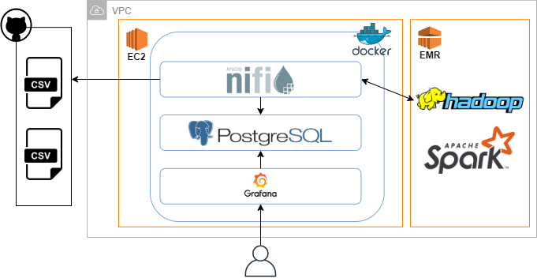

### **Covid Data Analysis with Apache Spark**
This is a repository for an academic project analyzing two datasets about Covid-19 outbreak.
The datasets were processed using Apache Spark in order to answer some queries about the trend of infections in Italy and
in the rest of the world. Two datasets were used:
* Dataset A (Italian data) available at: https://github.com/pcm-dpc/COVID-19/blob/master/dati-andamento-nazionale/dpc-covid19-ita-andamento-nazionale.csv
* Dataset B (Global data) available at: https://github.com/CSSEGISandData/COVID-19/blob/master/csse_covid_19_data/csse_covid_19_time_series/time_series_covid19_confirmed_global.csv
The query answered are the following:
1. Using dataset A, for each week determine the average number of cured people and the average number of swab tests
2. Using dataset B, for each continent determine the average, standard deviation, minimum and maximum number of confirmed cases
   on a weekly basis, considering only the top-100 affected states
3. Using dataset B and the to-50 affected states, for each month use K-means clustering algorithm to identify
   the states that belong to each cluster with respect to the trend of confirmed cases
 
#### Architecture Overview 
 

The datasets were processed on Apache Spark using an EMR cluster. The input files were imported into EMR HDFS through
Apache Nifi. The same tool was used to export query results from HDFS and put them into a Postgres database. Then 
a Grafana instance was connected to Postgres to visually display the results. Grafana, Nifi and Postgres was deployed
on an EC2 instance inside a Docker network.

#### Deployment Guide

* Launch an EMR cluster with Spark and Hadoop installed
* Launch an EC2 instance with at least 4O GB of hard storage (for Docker requirements)
  in the same VPC of the EMR cluster
* Allow the inbound traffic from the EC2 security groups in the security group
  of the EMR nodes 
* Download Hadoop configuration files (core-site.xml and hdfs-site.xml) from
  EMR master node using the `scp` command
* Remove compression codec properties tag from core-site.xml
* Move the script `ec2_instance_setup.sh` to the EC2 instance and run it.
  This will install Docker and git on the instance
* From the EC2 instance `git clone` this repository
* `cd CovidProject/deploy`
* Execute the script `setup_docker_network.sh`.
  This will run on EC2 a Docker network including: Nifi, Postgres, Pgadmin and Grafana
* Download the jar of the JDBC Postgres driver from https://jdbc.postgresql.org/download.html
* Move the downloaded jar, hdfs-site.xml and core-site.xml to
  the directory `CovidProject/deploy/nifi_data` on the EC2 instance
* Move the script `emr_setup.sh` to the EMR master and run it.
  This will create the directories used by Apache Nifi
* Open the WEB UI of the Nifi server on the EC2 instance (port 8080)
* Upload the Nifi templates contained in the directory `ingestion`
* After checking their configuration, execute the DataFlows to import datasets into EMR HDFS
* Upon completion, move the jar of the application to EMR master and run
  it with `spark-submit` specifying the required input parameters. 
* Connect to PgAdmin UI (port 80) on the EC2 instance and create a database using the dump `covid_db_dump`
* Connect to the Nifi UI and upload the templates contained in the directory `export`
* After configuring the templates, run them to ingest query results from EMR to Postgres
* Connect to Grafana UI (port 3000) on the EC2 instance to visually display results
 